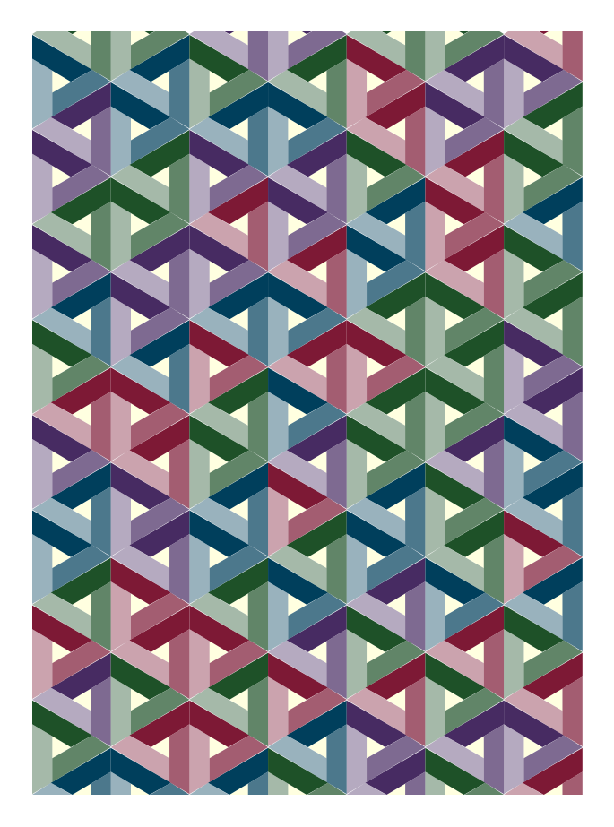

# Quilting

Collection of projects where I use programming to visualize and mock out quilt patterns.

## Entangled Sky

Used Python to visualize how to layout colors for the Entangled Sky pattern.

## Nine Patch

Example of using HTML, JavaScript, and CSS to simulate how to cut fabrics to make nine patch squares. Each square must have one of nine fabrics. There are three categories of fabric: black, white, and color. And each row and column must only have one of each category of fabric.

## Winding Block

Use SVG to visualize different color designs for the winding block pattern.

